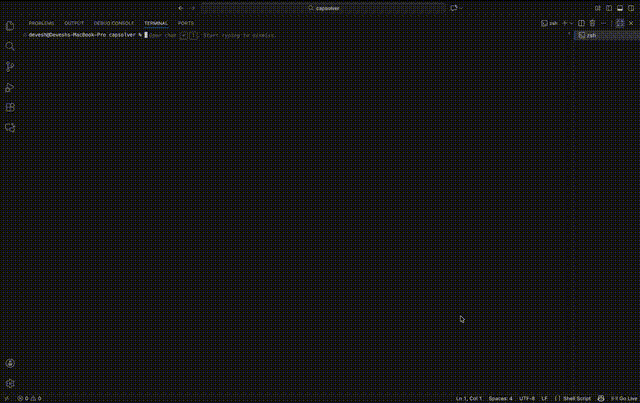

# Capsolver

Local reCAPTCHA v2 solver using Whisper. No API keys, runs entirely on your machine.



## How it works

reCAPTCHA v2 has an audio challenge. We click the captcha, switch to audio mode, download the audio, transcribe with Whisper, and submit. Near 100% success rate.

## Installation

```bash
git clone https://github.com/ibedevesh/capsolver.git
cd capsolver
./setup.sh
```

## Usage

```python
from src.recaptcha_v2 import RecaptchaV2Solver

solver = RecaptchaV2Solver(model_size="base")
result = solver.solve("https://example.com/page-with-captcha")

if result["success"]:
    token = result["token"]
```

**Model sizes:** `tiny` (fastest) → `base` (recommended) → `small` → `medium` → `large-v3` (best accuracy)

## License

MIT
